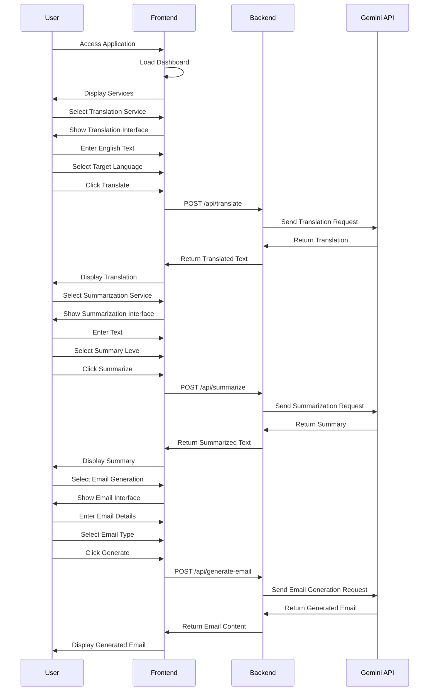

# Jayadhi Limited - Smart Utility Tool

A modern web application that provides AI-powered utilities for translation, text summarization, and email generation. Built with React, TypeScript, and Material-UI.

## Live Demo

Check out the live application: [Jayadhi Limited Smart Utility Tool](https://jayadhi-limited-fe.vercel.app/)

## Application Flow



## Features

### 1. Translation
- Translate text from English to multiple languages
- Support for 8+ languages including Spanish, French, German, Italian, Portuguese, Russian, Japanese, Korean, and Chinese
- Real-time translation with error handling
- Copy to clipboard functionality

### 2. Summarization
- Generate concise summaries of long texts
- Multiple summary levels (light, medium, extreme)
- Maintains key information and context
- Clean and readable output format

### 3. Email Generation
- Create professional emails quickly
- Multiple email types (formal, informal, urgent)
- Priority level selection
- Customizable templates

## Tech Stack

- **Frontend:**
  - React 18
  - TypeScript
  - Material-UI (MUI)
  - Vite
  - Axios for API calls
  - React Router for navigation

- **Backend:**
  - Node.js
  - Express.js
  - Gemini API integration
  - Vercel deployment

## Getting Started

### Prerequisites

- Node.js (v14 or higher)
- npm or yarn

### Installation

1. Clone the repository:
```bash
git clone https://github.com/your-username/jayadhi-limited.git
cd jayadhi-limited
```

2. Install dependencies:
```bash
# For frontend
cd frontend
npm install

# For backend
cd ../backend
npm install
```

3. Create a `.env` file in the backend directory:
```env
GEMINI_API_KEY = Add your api key from google studio 
PORT=3000
GEMINI_API_URL=https://generativelanguage.googleapis.com/v1beta/models/gemini-2.0-flash:generateContent

```

### Running the Application

1. Start the backend server:
```bash
cd backend
npm run dev
```

2. Start the frontend development server:
```bash
cd frontend
npm run dev
```

The application will be available at `http://localhost:5173`

### Building for Production

1. Build the frontend:
```bash
cd frontend
npm run build
```

2. Build the backend:
```bash
cd backend
npm run build
```

## Project Structure

```
jayadhi-limited/
├── frontend/
│   ├── src/
│   │   ├── components/
│   │   ├── pages/
│   │   ├── styles/
│   │   └── App.tsx
│   ├── package.json
│   └── vite.config.ts
├── backend/
│   ├── src/
│   │   ├── routes/
│   │   ├── controllers/
│   │   └── app.ts
│   └── package.json
└── README.md
```

## API Endpoints

- `POST /api/translate` - Translate text
- `POST /api/summarize` - Generate text summary
- `POST /api/generate-email` - Generate email content

